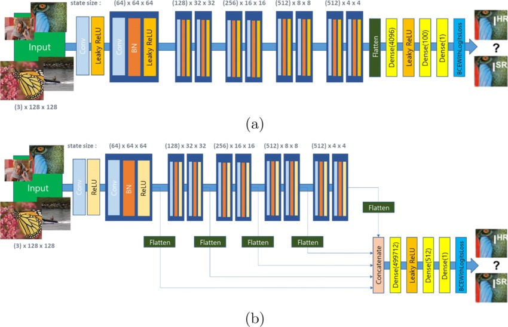

# OCT Image Processing and Classification

Welcome to the OCT Image Processing and Classification project! This project involves three main components:

1. *Denoising*: OCT images are denoised using CycleGANs.
2. *Super-Resolution*: Denoised images are enhanced using ESRGAN for super-resolution.
3. *Volumetric Classification*: Super-resolved images are classified using a 3D CNN architecture.

## Table of Contents
- [Project Overview](#project-overview)
- [Methods](#methods)
    - [Denoising with CycleGANs](#denoising-with-cyclegans)
    - [Super-Resolution with ESRGAN](#super-resolution-with-esrgan)
    - [Volumetric Classification with 3D CNN](#volumetric-classification-with-3d-cnn)
- [Data](#data)
- [Setup](#setup)
- [Usage](#usage)
- [Results](#results)
- [Conclusion](#conclusion)
- [License](#license)

## Project Overview

This project demonstrates a comprehensive approach to processing and classifying optical coherence tomography (OCT) images. By combining denoising, super-resolution, and classification techniques, we aim to improve the quality and accuracy of medical imaging analysis.

## Methods

### Denoising with CycleGANs
- *Description*: OCT images often contain noise that can hinder analysis. We employ CycleGANs to denoise these images effectively.
- *Details*: The CycleGAN model is trained using unpaired datasets to learn how to translate noisy images to denoised ones.

### Super-Resolution with ESRGAN
- *Description*: After denoising, we enhance the images using ESRGAN to achieve super-resolution.
- *Details*: The ESRGAN model is trained on pairs of low-resolution and high-resolution images to produce high-quality super-resolved images.

### Volumetric Classification with 3D CNN
- *Description*: We classify volumetric OCT images using a 3D CNN architecture.
- *Details*: The 3D CNN model is trained to classify images into different categories based on their volumetric features.

## Data

- *Dataset*: Provide information on the dataset used, including how to obtain it and any preprocessing steps.
- *Data Structure*: Describe the data structure and how the data is organized.

## Setup

To set up the project, follow these steps:
1. Clone the repository:
    bash
    git clone https://github.com/yourusername/yourrepository.git
    cd yourrepository
    

2. Install required packages:
    bash
    pip install -r requirements.txt
    

3. Download or prepare the dataset as described in the [Data](#data) section.

4. Set up the project according to the documentation provided in the respective method sections.

## Usage

- *Denoising*:
    bash
    python denoise.py --input <input_folder> --output <output_folder>
    

- *Super-Resolution*:
    bash
    python super_resolution.py --input <input_folder> --output <output_folder>
    

- *Volumetric Classification*:
    bash
    python classify.py --input <input_folder>
    

## Results

Provide a summary of the results obtained from each method, including any relevant metrics or visualizations.

## Conclusion

Summarize the project's outcomes, including the improvements made in OCT image quality and classification accuracy. Discuss any limitations encountered and potential areas for future work.

## License

Provide information about the project's license.

---

We hope you find this project useful and welcome contributions and feedback! Feel free to open an issue or pull request if you have any suggestions or improvements.
